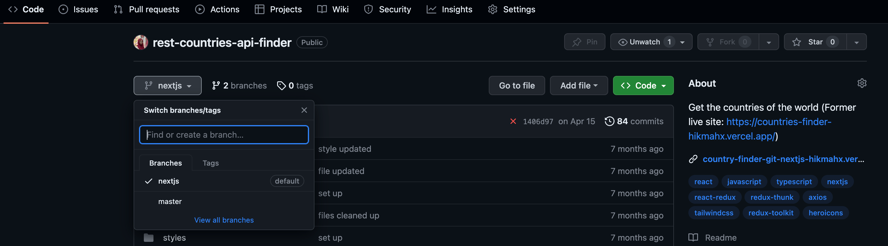

# Git and GitHub essentials: A beginner's guide

## To Check Git VErsion

> git --version OR git -v

## Enter your username to setup your account

> git config --global user.name "Your Name"

## To confirm that you have set your Git username correctly, enter:

> git config --global user.name

## Next, your email

> git config --global user.email "your.email@example.com"

## Check to confirm the email:

> git config --global user.email

# 💪 Git is now ready for use!

# ✅ Common Git commands

# 👉 git add

- The git add command is used to stage changes for the next commit

> git add [filename]

### or

> git add . (To add all changes at once, use:)

# 👉 git commit

- Once your changes are staged, it's time to save them. The git commit command captures a snapshot of your work along with a brief message describing the changes.

> git commit -m "Your message about what you did here"

- [Remember, keep it descriptive and to the point.]

# 👉 git status

- can check the status of your repository
  > git status

# ✅ Creating, switching, and merging branches

- A branch in Git is a separate or new version of the main repository. By default, when a repository is created, there is a main branch, the first and only branch in the repository. The default name of this branch is master, but is often updated to main, which is what I'll use going forward.

  

- Branches in Git allow you to diverge from the main line of development and continue working without affecting that main line. This is especially useful for developing new features, bug fixes, collaborations, or experimental changes. Each branch represents an independent line of development with its own commit history.

You can experiment without affecting the main project. Here's how you create, switch, and merge branches:

# 👉 git branch

- You can use the git branch command to create and name a new branch:
  > git branch [branch_name]

# 👉 git branch

- After creating a new branch or having more than one branch, you can switch between these branches using:

> git checkout [branch_name]

- Your working directory and files will be updated to reflect the chosen branch. Remember to pull changes after switching branches to have all the latest updates.

# 👉 git merge

- To merge changes from one branch into another, you can use git merge. For example, if you wanted to merge some changes from a feature branch into the main branch, you would first switch to the main branch using git checkout:

> git checkout main

- Then, merge the changes from the branch containing the feature:

  > git merge [branch_name]

- This process incorporates the updates from the feature branch into the main branch, ensuring that the main branch reflects the latest code changes.
